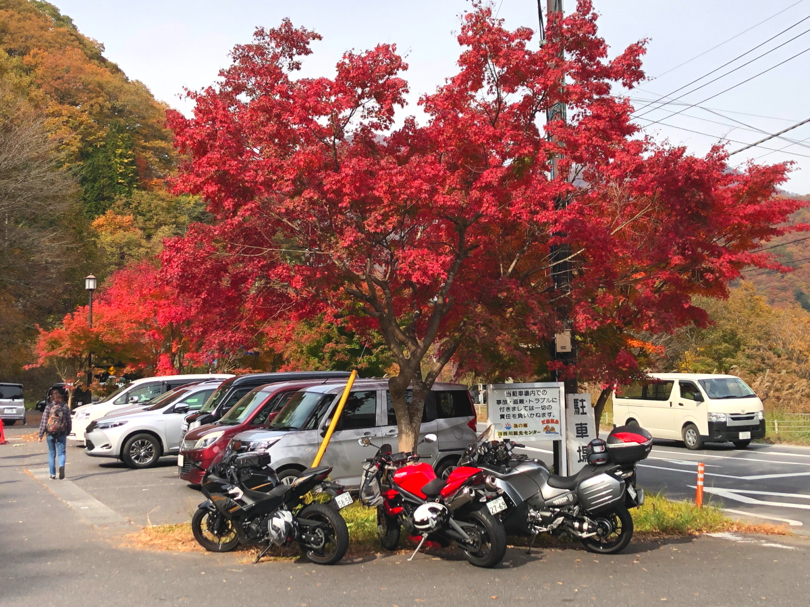
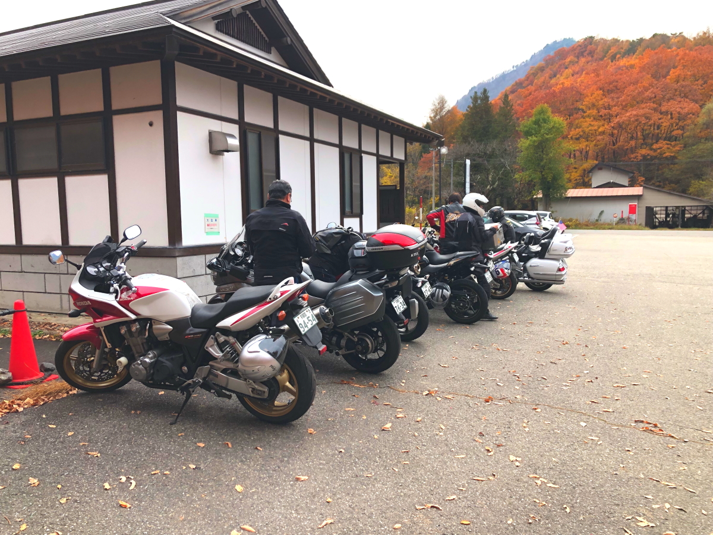
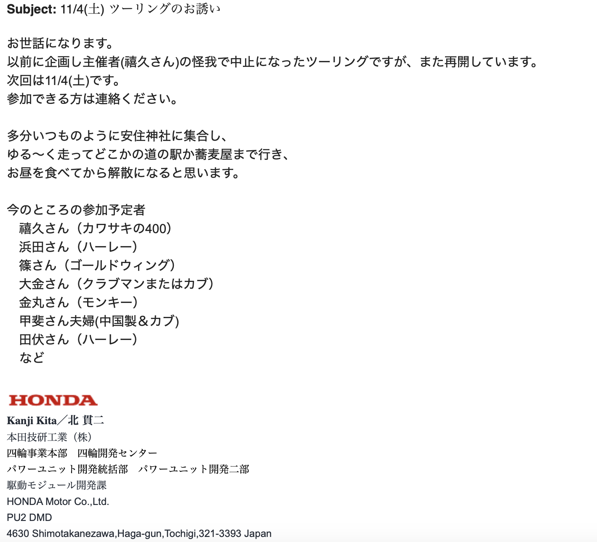

# 20231104_banya

<html>
<head>

<meta charset="UTF-8">
<meta http-equiv="Content-Type" content="text/html; charset=UTF-8">
<meta http-equiv="X-UA-Compatible" content="IE=EmulateIE10" />
<meta http-equiv="X-UA-Compatible" content="IE=edge">

<!--ここから上はお決まりの定型文です-->

<!--ここからが表現の書式などを決めるcssという部分-->

<link href="https://cdnjs.cloudflare.com/ajax/libs/lightbox2/2.7.1/css/lightbox.css" rel="stylesheet">

</head>

<body>
<!--
-->

<!--
<h2>

  モバイル端末をお使いの場合は、画面を横向きにすると
  より見やすくご覧頂けます。
	
</h2>
<!--ここ上は、ほぼそのまま使います！-->

<!--ぱんくずリスト-->
<!--

<a href="https://dorikawa.github.io/20210704_Utsunomiya_swim/">2021年宇都宮市民大会</a>><a href="https://dorikawa.github.io/HP_build/">IT関連情報IT関連情報</a>>HPの作り方

-->
<!--QRコードの挿入例-->

 アクセス用QRコード

	

<marquee direction="left" scrollamount="10" width="30%">(^_^)/~Satoshi_Hada</marquee>

<!--流れ文字の挿入例-->
<h1><marquee behavior="left">!!! 2023年11月4日、湯西川〜南会津番屋ツーリング !!!</marquee></h1>

<!--ここから下が、本体部分-->

湯西川道の駅で休憩

これ以降は南会津番屋

ここまではLINE共有画像

  

以下動画、全て限定公開 ⇒ アドレスを知らなければ見えません = このリンクからしか飛べません。

<iframe width="280" height="160" src="https://www.youtube.com/embed/xGt55eW3LI4?si=hCHVimTcvxKLc67U" title="YouTube video player" frameborder="0" allow="accelerometer; autoplay; clipboard-write; encrypted-media; gyroscope; picture-in-picture; web-share" allowfullscreen></iframe>
<iframe width="280" height="160" src="https://www.youtube.com/embed/esSWOceRTwY?si=Nw2I0wtjGgtwsVrX" title="YouTube video player" frameborder="0" allow="accelerometer; autoplay; clipboard-write; encrypted-media; gyroscope; picture-in-picture; web-share" allowfullscreen></iframe>
<iframe width="280" height="160" src="https://www.youtube.com/embed/s9crTuWLi2U?si=fdpeFgp4fFvO9oXG" title="YouTube video player" frameborder="0" allow="accelerometer; autoplay; clipboard-write; encrypted-media; gyroscope; picture-in-picture; web-share" allowfullscreen></iframe>
<iframe width="280" height="160" src="https://www.youtube.com/embed/1RiK38HgM0I?si=bNX05JA3puhZP4O6" title="YouTube video player" frameborder="0" allow="accelerometer; autoplay; clipboard-write; encrypted-media; gyroscope; picture-in-picture; web-share" allowfullscreen></iframe>
<iframe width="280" height="160" src="https://www.youtube.com/embed/vCATlDhJ_rQ?si=jqOX5iE1abDXjoub" title="YouTube video player" frameborder="0" allow="accelerometer; autoplay; clipboard-write; encrypted-media; gyroscope; picture-in-picture; web-share" allowfullscreen></iframe>
<iframe width="280" height="160" src="https://www.youtube.com/embed/pM2o8AjaUlk?si=pduodF8BPpzSWlC_" title="YouTube video player" frameborder="0" allow="accelerometer; autoplay; clipboard-write; encrypted-media; gyroscope; picture-in-picture; web-share" allowfullscreen></iframe>
<iframe width="280" height="160" src="https://www.youtube.com/embed/P4fl9DbwKFo?si=653xlpczpBp2lgYu" title="YouTube video player" frameborder="0" allow="accelerometer; autoplay; clipboard-write; encrypted-media; gyroscope; picture-in-picture; web-share" allowfullscreen></iframe>
<iframe width="280" height="160" src="https://www.youtube.com/embed/PKpMxAnZI_E?si=ZLri9Zn3gBCns0UK" title="YouTube video player" frameborder="0" allow="accelerometer; autoplay; clipboard-write; encrypted-media; gyroscope; picture-in-picture; web-share" allowfullscreen></iframe>
<iframe width="280" height="160" src="https://www.youtube.com/embed/MhJVLRaVwBw?si=w_AVyms3V34NqarK" title="YouTube video player" frameborder="0" allow="accelerometer; autoplay; clipboard-write; encrypted-media; gyroscope; picture-in-picture; web-share" allowfullscreen></iframe>

  

        

	
	
	
	

<!--
-->
<!--本体はここまで-->

<!--画面に空白地帯を作って、背景が見えるようにしています-->
                                              

<h6>

 2023/11/04、南会津番屋！

</h6>
<!-- フッタ -->
<footer>
	 2023/11/04 Satoshi.Hada
</footer>

<!--HPにさまざまなJavaScriptを呼び込むための書式-->

</body>

</html>
